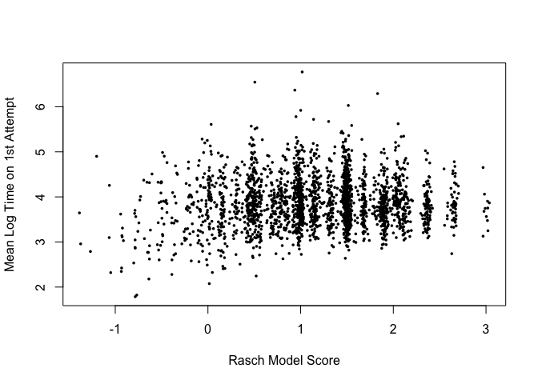

Rationale Behind the Project
============================

The purpose of this project is to better understand how students’
response times on assessment questions are related to student and
question level attributes. There are many reasons that teachers and/or
developers of online learning systems might be interested in
understanding, or even predicting student response times. For example, a
teacher who is interested in designing a test to measure student ability
might want to know how much time to allot for each question. To make
this determination, it would be useful to investigate the following: 1)
Do more “difficult” questions require more time on average (and how much
more time)?, and 2) Do students with higher ability levels tend to
respond to questions more quickly?

With respect the second question above, there might be additional
nuance: for example, previous research has shown that it may be possible
to identify students who are cheating by looking for exceptionally low
response times. For lower stakes assessments, or assessments where
students are given additional opportunities to correct their work, it is
also possible that quick responses are associated with guessing and/or
giving up early. Thus, we might expect that stronger students tend to
answer questions more quickly to a point, beyond which fast responses
are actually related to negative learning behaviors, like cheating or
giving up.

Finally, this research aims to understand whether student persistence
(i.e., unwillingness to give up, even after getting a question wrong)
might be additionally relevant in predicting response times. For
example, it is possible that highly persistent students spend
comparatively more time on test questions because they are also more
exhaustive in understanding every aspect of the question and their
answer. Conversely, it is possible that highly persistent students are
also stronger students overall, and therefore tend to respond faster. In
any case, understanding the relationship between response time and
student persistence (holding student ability and question difficulty
constant) is important when a) designing timed assessments and b)
estimating student ability based on time in addition to correctness.

The Data
========

The data for this analysis comes from a massive open online course
(MOOC) called Money in Business 1. My final analysis is based on data
from 2387 students (I only included students who responded to at least
one question, and for whom I could reasonably estimate attempt times).
The full course includes 30 quiz questions, which were asked over the
course of four weeks. The data that I used comes from three files:  
1. An enrollments file, which contains enrollment information for every
student who signed up for the course  
2. A question and response file, which is structured such that every row
corresponds to a single student responding to a single question (and
contains columns indicating the time that a response was submitted and
whether it was correct or not)  
3. A step activity file, which contains time stamps for every click to a
new “step” or module within the course

Cleaning and Organizing the Data for Analysis
=============================================

In the code –&gt; Create\_Files.R script, I have outlined the functions
and process that I used to clean and organize the data. These steps are
also outlined below:

1.  Run the AttemptNums function to create the file Money Run
    1AttNums.csv. This function uses the original enrollments file and
    question response file to:
    1.  Create a data frame where every row represents a particular
        student’s interaction with a particular question.  
    2.  For every student and question, an NA means that the student did
        not attempt the question, a positive value represents the number
        of attempts until the student answered with the correct
        response, and a negative value represents the number of attempts
        that the student made before giving up.
2.  Run the SimpleAtts function to create the file Money Run
    1simpleatts.csv. This function uses the data frame created in 1 to:
    1.  Create a data frame where rows are students, columns are
        questions, and values in each cell are 1, 0, or NA  
    2.  1 means that the question was answered correctly on the first
        try, 0 means incorrect on first try, and NA means that the
        question was not attempted.
3.  Run the function Atts1to4 to create the file Money Run
    1AttTimes1to4.csv. This function uses the original enrollments,
    question response, and step activity files to recover attempt times
    for attempts 1-4. I chose to restrict all of my analysis to 4
    attempts because very few people made more than that on any
    question. This function works as follows:
    1.  Uses the step activity file to recover the first time that
        students opened a step activity that involved questions.  
    2.  For all questions that were not the first in a step activity,
        recovers the last submission time for the previous question
        (this is the very last submission time, even if the person made
        more than 4 attempts because they got the question right and
        then kept making more attempts).  
    3.  Fills in all time stamps for attempts 1 through 4.  
    4.  Uses time stamps for all attempts and last interaction with a
        previous question or step activity to populate 1st, 2nd, 3rd,
        and 4th attempt times.
4.  Run the GiveUpPercent function to create the file Money Run
    1GiveUp.csv. This function uses the attempt numbers file created in
    1 to evaluate the percent of opportunities that students used out of
    the total number of opportunities that they had to make another
    attempt on a problem (after an incorrect answer). So, if a student
    got a question correct on the third try, they had two opportunities
    to re-try the question after getting it wrong, and they used both.
    If a person made three attempts at a problem and never got it right,
    then they had three opportunities to retry the question after a
    wrong answer, but they only used two of them. In the resulting file:
    1.  Students who got all questions right on the first try, and
        therefore never had any opportunities to re-try a question that
        they got wrong, are coded as NAs in this file.
5.  Use the attempt numbers file from 1, the attempt times file from 3,
    and information about item difficulty (calculated using a Rasch
    model on the simple attempts file from 2) to create a question
    summary file (saved as Money Run 1QuestionSumm.csv) with the
    following information for each question:
    1.  PropAttemptedQ: proportion of learners who attempted the problem
    2.  PropCorrect1stQ: proportion of learners who got the question
        correct on the first attempt (out of those who made at least one
        attempt)
    3.  PropGaveUpQ: proportion of learners who never got the question
        correct (out of those who made at least one attempt)
    4.  PropGaveUpAfterWrongQ: proportion of learners who never got the
        question correct (out of those who were wrong on the first
        attempt)
    5.  MeanLogTimeAtt1Q: mean log time spent on students’ first attempt
        for that question  
    6.  RaschDiff: The difficulty of the question, as estimated from a
        Rasch model on the simple attempts file
6.  Use the the attempt times file from 3, simple attempt numbers from
    2, and information about student ability estimated using the same
    Rasch model as above to create a learner summary file with the
    following information for each learner:
    1.  PropAttempted: proportion of questions that they attempted
    2.  RaschAbility: their score based on a Rasch model
    3.  PropCorrect1st: the proportion of questions that they answered
        correctly on the first try (out of the questions that they
        attempted)
    4.  MeanLogTotalTime: mean log of the total time they spent across
        all questions that they attempted
    5.  MeanLogTimeAtt1: mean log of the first attempt times across all
        questions that they attempted
7.  Use dplyr to join some of the above datasets to create a final
    dataset (saved as Money Run 1FinalData.csv), which has a separate
    row for every student’s attempt on every question, with a column
    representing the student’s first attempt time for that question, the
    student’s overall Rasch score, the difficulty of the question, and
    the proportion of opportunities to retry a question that the student
    utilized.

Initial Data Exploration
========================

My initial data exploration involved the following discoveries:

1.  When looking at the distribution of attempt times (in seconds)
    vs. log attempt times, the log attempt times are much closer to
    normally distributed, whereas the regular attempt times are very
    right skewed. This influenced my decision to model log attempt time
    instead of regular attempt time. This can be seen in the following
    histograms, which show attempt times in seconds and log attempt
    times for the first question in this course:  
    

2.  It is fairly clear by looking at the question summary that easier
    questions take students less time (on average) than harder
    questions. In the following plot, mean log first attempt time on any
    given question is plotted against question difficulty based on Rasch
    model estimates:  
    

3.  The relationship between student ability and mean log time on first
    attempts is slightly more complicated. The following plot shows mean
    log time on first attempts against estimated student ability (from a
    Rasch model). It looks like, for lower ability levels, mean log time
    on first attempts increases as students’ estimated ability
    increases. However, for students whose estimated ability is greater
    than about -.5, mean log time on first attempt stabilizes or even
    decreases. This pattern is shown in the smoothed plot below:  
    

Final Modeling
==============

Because I found that there appeared to be some quadratic relationship
between time on first attempt and ability level, my initial model
included a squared term for ability (as measured by the Rasch model). I
also included an interaction term between ability and difficulty,
because I hypothesized that the impact of question difficulty on
response times would be different depending on student ability levels.
Therefore, my first baseline model was as follows (note: I also ran the
model on a dataset with missing data for PropUsedOpp removed so that the
R squared value could be compared to the R squared in my next model):

``` r
finaldata$RaschAbilitySq <- finaldata$RaschAbility^2
fit_base <- lm(log(Att1_Time)~(RaschAbility+RaschAbilitySq)*RaschDiff, data=finaldata)
summary(fit_base)
```

    ## 
    ## Call:
    ## lm(formula = log(Att1_Time) ~ (RaschAbility + RaschAbilitySq) * 
    ##     RaschDiff, data = finaldata)
    ## 
    ## Residuals:
    ##     Min      1Q  Median      3Q     Max 
    ## -2.8959 -0.5717 -0.0806  0.4873  4.4185 
    ## 
    ## Coefficients:
    ##                           Estimate Std. Error t value Pr(>|t|)    
    ## (Intercept)               3.650343   0.008272  441.30   <2e-16 ***
    ## RaschAbility              0.298709   0.012157   24.57   <2e-16 ***
    ## RaschAbilitySq           -0.096250   0.005118  -18.81   <2e-16 ***
    ## RaschDiff                 0.353912   0.011178   31.66   <2e-16 ***
    ## RaschAbility:RaschDiff    0.268715   0.016535   16.25   <2e-16 ***
    ## RaschAbilitySq:RaschDiff -0.074993   0.006963  -10.77   <2e-16 ***
    ## ---
    ## Signif. codes:  0 '***' 0.001 '**' 0.01 '*' 0.05 '.' 0.1 ' ' 1
    ## 
    ## Residual standard error: 0.8748 on 36855 degrees of freedom
    ## Multiple R-squared:  0.1852, Adjusted R-squared:  0.1851 
    ## F-statistic:  1675 on 5 and 36855 DF,  p-value: < 2.2e-16

``` r
#subsetting to only include non-missing data
finaldata2 <- finaldata[!is.na(finaldata$PropUsedOpp),]
#re-run same model without missing data:  
fit_base2 <- lm(log(Att1_Time)~(RaschAbility+RaschAbilitySq)*RaschDiff, data=finaldata2)
summary(fit_base2)
```

    ## 
    ## Call:
    ## lm(formula = log(Att1_Time) ~ (RaschAbility + RaschAbilitySq) * 
    ##     RaschDiff, data = finaldata2)
    ## 
    ## Residuals:
    ##     Min      1Q  Median      3Q     Max 
    ## -2.8956 -0.5748 -0.0801  0.4888  4.4274 
    ## 
    ## Coefficients:
    ##                           Estimate Std. Error t value Pr(>|t|)    
    ## (Intercept)               3.650104   0.008313 439.100   <2e-16 ***
    ## RaschAbility              0.300549   0.012506  24.032   <2e-16 ***
    ## RaschAbilitySq           -0.096928   0.005516 -17.572   <2e-16 ***
    ## RaschDiff                 0.354219   0.011234  31.532   <2e-16 ***
    ## RaschAbility:RaschDiff    0.263256   0.017015  15.472   <2e-16 ***
    ## RaschAbilitySq:RaschDiff -0.072547   0.007520  -9.647   <2e-16 ***
    ## ---
    ## Signif. codes:  0 '***' 0.001 '**' 0.01 '*' 0.05 '.' 0.1 ' ' 1
    ## 
    ## Residual standard error: 0.878 on 35587 degrees of freedom
    ## Multiple R-squared:  0.1821, Adjusted R-squared:  0.1819 
    ## F-statistic:  1584 on 5 and 35587 DF,  p-value: < 2.2e-16

Note that all of the predictors are significant at a .05 significance
level. As expected, higher difficulty questions tend to have slower
response times. Also as expected, the coefficient on RaschAbility (which
measures student ability) is positive, but the coefficient on
RaschAbility^2 is negative, indicating that higher ability levels are
associated with longer response times to a point, at which point higher
abilities are associated with faster response times. All of the
interaction terms are also significant, suggesting that the relationship
between question difficulty and response time is different depending on
student ability levels. Overall, these factors are accounting for just
over 18% of the variation in log first attempts times. Therefore, these
factors explain some of the variation in response time, but there is
still a lot of extra noise.

After running these baseline models, I then added my measure of student
resiliency and re-ran the model.

``` r
#first alternate model
fit_M1 <- lm(log(Att1_Time)~(RaschAbility+RaschAbilitySq)*RaschDiff+PropUsedOpp, data=finaldata)
summary(fit_M1)
```

    ## 
    ## Call:
    ## lm(formula = log(Att1_Time) ~ (RaschAbility + RaschAbilitySq) * 
    ##     RaschDiff + PropUsedOpp, data = finaldata)
    ## 
    ## Residuals:
    ##     Min      1Q  Median      3Q     Max 
    ## -2.9028 -0.5758 -0.0809  0.4891  4.4163 
    ## 
    ## Coefficients:
    ##                           Estimate Std. Error t value Pr(>|t|)    
    ## (Intercept)               3.502324   0.031581 110.901  < 2e-16 ***
    ## RaschAbility              0.291742   0.012633  23.093  < 2e-16 ***
    ## RaschAbilitySq           -0.095186   0.005526 -17.225  < 2e-16 ***
    ## RaschDiff                 0.353976   0.011230  31.520  < 2e-16 ***
    ## PropUsedOpp               0.162703   0.033544   4.850 1.24e-06 ***
    ## RaschAbility:RaschDiff    0.263400   0.017010  15.485  < 2e-16 ***
    ## RaschAbilitySq:RaschDiff -0.072536   0.007518  -9.649  < 2e-16 ***
    ## ---
    ## Signif. codes:  0 '***' 0.001 '**' 0.01 '*' 0.05 '.' 0.1 ' ' 1
    ## 
    ## Residual standard error: 0.8777 on 35586 degrees of freedom
    ##   (1268 observations deleted due to missingness)
    ## Multiple R-squared:  0.1826, Adjusted R-squared:  0.1825 
    ## F-statistic:  1325 on 6 and 35586 DF,  p-value: < 2.2e-16

``` r
#run and anova comparing to baseline model
anova(fit_base2, fit_M1)
```

    ## Analysis of Variance Table
    ## 
    ## Model 1: log(Att1_Time) ~ (RaschAbility + RaschAbilitySq) * RaschDiff
    ## Model 2: log(Att1_Time) ~ (RaschAbility + RaschAbilitySq) * RaschDiff + 
    ##     PropUsedOpp
    ##   Res.Df   RSS Df Sum of Sq      F    Pr(>F)    
    ## 1  35587 27432                                  
    ## 2  35586 27414  1    18.124 23.526 1.237e-06 ***
    ## ---
    ## Signif. codes:  0 '***' 0.001 '**' 0.01 '*' 0.05 '.' 0.1 ' ' 1

PropUsedOpp is also a significant (at a .05 level) positive predictor of
response time, suggesting that students who take more advantage of
additional attempts also tend to take longer on their first attempt.
Adjusted R squared increased, but only by about 0.0006, so it’s not
totally clear whether the addition of PropUsedOpp accounts for enough
additional variance in log response time to justify the more complex
model (note: the F test above is statistically significant at a .05
level, suggesting that the addition of PropUsedOpp is warranted).

Other explorations
==================

My initial interest when I first began this project was in understanding
whether I could measure student resilience by looking at student
response patterns. My hypothesis was that I could identify students who
had given up by looking for quick, repeated responses. In this initial
pursuit, I noted the following:

The following table shows mean log response times for 1st through 4th
attempts. As expected, students tend to spend less time on every
subsequent attempt:

|  1st Att|  2nd Att|  3rd Att|  4th Att|
|--------:|--------:|--------:|--------:|
|      4.4|     3.58|     2.96|     2.43|

To take a closer look at students who were making many quick attempts, I
subsetted the data to only include student-question pairs where the
student made 3 or more attempts on the question and the mean time spent
on non-first attempts was under 5 seconds. There were 544
question-student pairs that met this criterion (representing 237 unique
learners answering all 30 of the unique questions). Among these
students, I saw that mean log response time on first attempts was also
much shorter than what I calculated for the entire dataset above.
However, resiliency scores were similar among this group as compared to
the whole population.

``` r
#subsetting the data: fastresp
finaldata$AvgTimeNotFirstAtt<-rowMeans(finaldata[,c(4:6)], na.rm=TRUE)
IDs <- finaldata$Atts>=3 & finaldata$AvgTimeNotFirstAtt<5
fastresp <- finaldata[IDs,]

length(unique(fastresp$Learner))#number of unique learners in this subset
```

    ## [1] 237

``` r
length(unique(fastresp$Question))#number of unique questions in this subset
```

    ## [1] 30

``` r
round(log(mean(fastresp$Att1_Time)),2)#mean log att 1 response time for this subset
```

    ## [1] 3.62

``` r
round(mean(fastresp$PropUsedOpp,na.rm=T),2) #mean resiliency score (subsetted data)
```

    ## [1] 0.95

``` r
round(mean(finaldata$PropUsedOpp,na.rm=T),2) #mean resiliency score (full data)
```

    ## [1] 0.95

It is reasonable to assume that students who tend to answer quickly on
second (or 3rd or fourth) attempts also tend to answer more quickly on
first attempts. The plot below shows this positive correlation (with
regression line in in red). However, it is also possible that this type
of behavior is indicative of some other aspect of student
persistence/carefulness (or lack thereof), which is also predictive of
response times, beyond what is already captured in the resilience score
used above.  


Ideas for Further Analysis
==========================

1.  Based on the ideas presented in the previous section, it would be
    interesting to see if I could design a more sensitive measure of
    student resilience, which measures students’ tendency to go into
    “guessing” mode after getting a question wrong, and see if I could
    use this measure to more accurately predict students’ response
    times.  
2.  There are multiple runs of the Money in Business course, so it would
    be interesting to run the same analysis with the subsequent versions
    of the course and see whether I observe the same patterns.
    Similarly, it would be interesting to try this with other courses
    and examine the degree to which the relationship between response
    time and question difficulty, student ability, and student
    persistence are different for those coures. It would also be
    interesting to run a similar analysis for questions that are
    higher-stakes or completed with time pressure.
