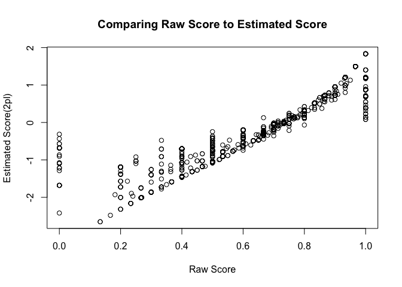

``` r
#load libraries
require(edstan)
require(rstanarm)
require(mirt)
require(ltm)
require(dplyr)

#load data
questionsumm <- read.csv(file="../clean_data/Money Run 1QuestionSumm.csv", row.names = 1)
learnersumm <- read.csv(file="../clean_data/Money Run 1LearnerSumm.csv", row.names = 1)
respmat <- read.csv(file="../clean_data/Money Run 1simpleatts.csv", row.names = 1)
```

When I first tried to use a Rasch model (using the gpcm function in the
ltm package) to estimate question difficulty and student ability, I got
a relatively strange result: all of the estimated scores were negative
(although they should be normally distributed and centered around 0,
which is one of the assumptions of the model). All of the beta
coefficients were also negative (which is why the scores were negative)

``` r
#fit a rasch model
rasch_fit <- ltm::gpcm(respmat[,1:30], constraint = "rasch") 

#estimate scores based off model fit (i.e., student ability)
scores <- ltm::factor.scores(rasch_fit, resp.patterns = respmat[,1:30])
scores <- scores$score.dat$z1

#view a histogram of estimated scores
hist(scores)
```


``` r
#also inspect estimated beta coefficients
rasch_fit$coefficients
```

    ## $X11201
    ##   Catgr.1    Dscrmn 
    ## -1.612881  1.000000 
    ## 
    ## $X11202
    ##   Catgr.1    Dscrmn 
    ## -1.891009  1.000000 
    ## 
    ## $X11203
    ##   Catgr.1    Dscrmn 
    ## -1.090868  1.000000 
    ## 
    ## $X11204
    ##   Catgr.1    Dscrmn 
    ## 0.4099646 1.0000000 
    ## 
    ## $X11205
    ##    Catgr.1     Dscrmn 
    ## -0.2412706  1.0000000 
    ## 
    ## $X21101
    ##  Catgr.1   Dscrmn 
    ## -1.39763  1.00000 
    ## 
    ## $X21102
    ##   Catgr.1    Dscrmn 
    ## -1.333667  1.000000 
    ## 
    ## $X21103
    ##   Catgr.1    Dscrmn 
    ## -2.276238  1.000000 
    ## 
    ## $X21104
    ##   Catgr.1    Dscrmn 
    ## -1.340496  1.000000 
    ## 
    ## $X21105
    ##   Catgr.1    Dscrmn 
    ## 0.1002975 1.0000000 
    ## 
    ## $X31101
    ##  Catgr.1   Dscrmn 
    ## -2.30632  1.00000 
    ## 
    ## $X31102
    ##    Catgr.1     Dscrmn 
    ## -0.4113007  1.0000000 
    ## 
    ## $X31103
    ##   Catgr.1    Dscrmn 
    ## -0.641938  1.000000 
    ## 
    ## $X31104
    ##   Catgr.1    Dscrmn 
    ## -1.468049  1.000000 
    ## 
    ## $X31105
    ##   Catgr.1    Dscrmn 
    ## -1.665268  1.000000 
    ## 
    ## $X40801
    ##   Catgr.1    Dscrmn 
    ## -2.091644  1.000000 
    ## 
    ## $X40802
    ##   Catgr.1    Dscrmn 
    ## -0.744019  1.000000 
    ## 
    ## $X40803
    ##   Catgr.1    Dscrmn 
    ## -2.350589  1.000000 
    ## 
    ## $X40804
    ##   Catgr.1    Dscrmn 
    ## -1.080137  1.000000 
    ## 
    ## $X40805
    ##   Catgr.1    Dscrmn 
    ## -2.140542  1.000000 
    ## 
    ## $X41101
    ##   Catgr.1    Dscrmn 
    ## -0.950706  1.000000 
    ## 
    ## $X41102
    ##    Catgr.1     Dscrmn 
    ## -0.5944505  1.0000000 
    ## 
    ## $X41103
    ##  Catgr.1   Dscrmn 
    ## -1.53866  1.00000 
    ## 
    ## $X41104
    ##   Catgr.1    Dscrmn 
    ## -1.968736  1.000000 
    ## 
    ## $X41105
    ##    Catgr.1     Dscrmn 
    ## -0.6260961  1.0000000 
    ## 
    ## $X41106
    ##    Catgr.1     Dscrmn 
    ## -0.4080993  1.0000000 
    ## 
    ## $X41107
    ##   Catgr.1    Dscrmn 
    ## -1.030178  1.000000 
    ## 
    ## $X41108
    ##    Catgr.1     Dscrmn 
    ## -0.7941621  1.0000000 
    ## 
    ## $X41109
    ##    Catgr.1     Dscrmn 
    ## -0.7788691  1.0000000 
    ## 
    ## $X41110
    ##    Catgr.1     Dscrmn 
    ## -0.5327096  1.0000000

On the advice of my professor, I also checked to see if mirt::mirt()
would give anything different, but I got similar (and also negative)
estimates for all of the beta coefficients.

``` r
#get difficulty estimates from mirt package
mod <- mirt(respmat, 1, 'Rasch')
```

    ## 
    Iteration: 1, Log-Lik: -20951.838, Max-Change: 0.74399
    Iteration: 2, Log-Lik: -20228.090, Max-Change: 0.20494
    Iteration: 3, Log-Lik: -20137.643, Max-Change: 0.12140
    Iteration: 4, Log-Lik: -20081.363, Max-Change: 0.10221
    Iteration: 5, Log-Lik: -20037.618, Max-Change: 0.08533
    Iteration: 6, Log-Lik: -20004.498, Max-Change: 0.07039
    Iteration: 7, Log-Lik: -19980.484, Max-Change: 0.05893
    Iteration: 8, Log-Lik: -19963.757, Max-Change: 0.04842
    Iteration: 9, Log-Lik: -19952.505, Max-Change: 0.03915
    Iteration: 10, Log-Lik: -19945.149, Max-Change: 0.03120
    Iteration: 11, Log-Lik: -19940.446, Max-Change: 0.02456
    Iteration: 12, Log-Lik: -19937.489, Max-Change: 0.01914
    Iteration: 13, Log-Lik: -19933.689, Max-Change: 0.01031
    Iteration: 14, Log-Lik: -19933.202, Max-Change: 0.00490
    Iteration: 15, Log-Lik: -19932.977, Max-Change: 0.00266
    Iteration: 16, Log-Lik: -19932.834, Max-Change: 0.00175
    Iteration: 17, Log-Lik: -19932.765, Max-Change: 0.00082
    Iteration: 18, Log-Lik: -19932.733, Max-Change: 0.00047
    Iteration: 19, Log-Lik: -19932.715, Max-Change: 0.00029
    Iteration: 20, Log-Lik: -19932.704, Max-Change: 0.00014
    Iteration: 21, Log-Lik: -19932.698, Max-Change: 0.00008

``` r
coef.mod <- coef(mod, IRTpars=TRUE, simplify=TRUE)

#inspect estimated beta coefficients
coef.mod$items[,2]
```

    ##      X11201      X11202      X11203      X11204      X11205      X21101 
    ## -1.61071507 -1.88853855 -1.08952251  0.40886747 -0.24128048 -1.39625933 
    ##      X21102      X21103      X21104      X21105      X31101      X31102 
    ## -1.33235541 -2.27402245 -1.33921077  0.09988368 -2.30427535 -0.41109827 
    ##      X31103      X31104      X31105      X40801      X40802      X40803 
    ## -0.64150270 -1.46670954 -1.66373683 -2.08983105 -0.74352097 -2.34858349 
    ##      X40804      X40805      X41101      X41102      X41103      X41104 
    ## -1.07927331 -2.13871306 -0.94977574 -0.59395867 -1.53716536 -1.96695348 
    ##      X41105      X41106      X41107      X41108      X41109      X41110 
    ## -0.62566296 -0.40793109 -1.02936883 -0.79359662 -0.77831882 -0.53242545

Next, also based on a suggestion from my professor, I tried fitting a
2-PL model (which assumes constant *α* accross all items, but does not
restrict *α* = 1 for all items). This time, estimated ability values
appeared roughly normally distributed (centered around zero), as I would
have expected.

``` r
twopl_fit <- ltm::rasch(respmat[,1:30])
scores_twopl <- factor.scores(twopl_fit, resp.patterns = respmat[,1:30])
scores_twopl <- scores_twopl$score.dat$z1
hist(scores_twopl)
```


However, I now encountered a new problem. First, I compared students’
estimated scores with their raw scores (proportion of questions answered
correctly on the first try), and there was a positive correlation as I
would have expected. Then, I compared the raw difficulty of the question
(proportion of students who answered the question correctly on the first
try) and compared to the estimated difficulty of each question. Now, the
estimates no longer made sense. Questions with a higher proportion of
students answering correctly on the first try should be “easier” and
therefore have lower estimated difficulty. However, the reverse was
true: there was a positive association between the proportion of
students answering the question correctly and the estimated difficulty
of the question. To date, I have no good explanation of why that would
be and cannot seem to simulate a similar result.

``` r
respmat$score_2pl <- scores_twopl
respmat$scoreRaw <- rowMeans(respmat[,1:30],na.rm=T)
difficulties <- twopl_fit$coefficients[,1]
questionsumm$difficulty_2pl <- difficulties
plot(respmat$scoreRaw, respmat$score_2pl, 
     xlab= "Raw Score", ylab="Estimated Score(2pl)", 
     main="Comparing Raw Score to Estimated Score")
```



``` r
plot(questionsumm$PropCorrect1stQ, questionsumm$difficulty_2pl, 
     xlab= "Proportion Correct", ylab="Estimated Difficulty(2pl)", 
     main="Comparing Raw Difficulty to Estimated Difficulty")
```


Now, out of curiosity, I tried running a Bayesian model and taking the
mean difficulty estimates and ability estimates from the resulting
posterior distributions for each.

``` r
rstan_options(auto_write = TRUE)
options(mc.cores = parallel::detectCores())
```

``` r
#save data in the appropriate format
list <- irt_data(response_matrix = respmat[,1:30])
```

``` r
#fit the model
fit_rasch <- irt_stan(list, 
                      model = "rasch_latent_reg.stan",
                      refresh = 0,
                      iter = 300, 
                      chains = 4)
```

``` r
#obtain mean beta and theta estimates
res <- as.data.frame(fit_rasch)
betas <- colMeans(res)[2419:2448]
thetas <- colMeans(res)[30:2416]
```

Now, when I plotted the mean estimated difficulties from the Bayesian
Rasch model against the proportion of students answering the question
correctly on the first try, I got a result that made sense: harder
questions have a smaller proportion of students answering them correctly
on the first try.

``` r
#check whether question difficulty estimates make sense given the data by comparing
#to proportion of students who attempted the question who answered correctly on their first try
estdiff <- data.frame(Question=as.numeric(substring(colnames(respmat[,1:30]),2)),
                      RaschDiff = betas)
questionsumm <- left_join(questionsumm,estdiff, by="Question")
```

``` r
#this plot (with Bayesian estimates) looks as expected
plot(questionsumm$RaschDiff,questionsumm$PropCorrect, 
     xlab="Estimated Difficulty",
     ylab="Prop. of Stud. Who Answered Quest. Correctly",
     main="Fit using edstan")
```


Just to check, I also plotted estimated abilities (mean values from the
posterior distributions of thetas from the Bayesian Rasch model) against
raw scores, and these were still positively associated as expected.
Therefore, I ended up using the estimates from the Bayesian approach in
my final analysis. However, if anyone has other ideas for what’s going
on here, please let me know!

``` r
#check whether ability (theta) estimates make sense given the data by comparing to 
#proportion of questions students answered correctly on their first try (out of those attempted)
learners <- rownames(respmat)
estability <- data.frame(Learner=learners,
                         RaschAbility = thetas)

learnersumm <- left_join(learnersumm,estability, by="Learner")

#note: this plot looks as expected
plot(learnersumm$RaschAbility,learnersumm$PropCorrect,
     xlab="Estimated Ability",
     ylab="Raw Score")
```


